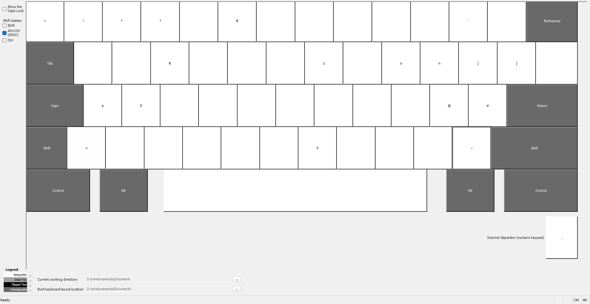
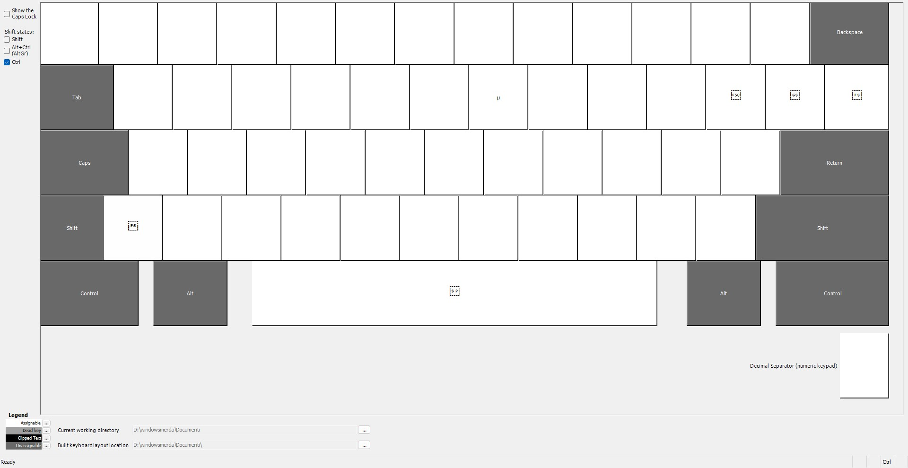
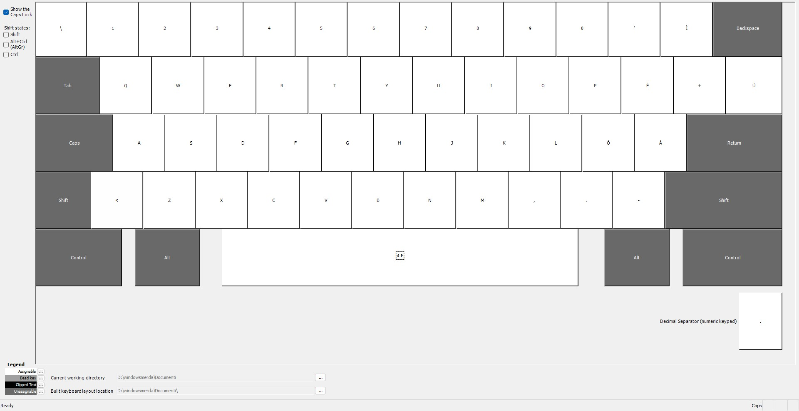

# Win-Ita-Enhanced
> A custom Windows keyboard layout that fixes the lack of features in the standard Italian QWERTY.

## Why did I do that
I was bored and pissed off by the lack of features in the standard Italian QWERTY Layout on Windows compared to Linux keyboards.
I'm not a designer or anything; I just added some useful features to the Italian QWERTY Layout, like capital letters with CAPSLOCK.

## Prerequisites
- To use this layout, you need to install MSKLC. You can download it from the [Microsoft website](https://www.microsoft.com/en-us/download/details.aspx?id=102134).
- An Italian QWERTY keyboard (or similar; works on German layouts too).

# Keyboard Layout Enhancements

This project provides a set of keyboard shortcuts and combinations to simplify typing accented characters, German umlauts, programming symbols, typographic punctuation, and technical symbols on a Windows system.

## Features

### Overview
**AltGr**

**AltShift**

**Ctrl**

**CapsLock**

### Accented Characters with Caps Lock
Typing letters with `Caps Lock` produces the corresponding uppercase accented letters:

| Shortcut      | Output |
|---------------|--------|
| `Caps + à`    | &#192; |
| `Caps + è`    | &#200; |
| `Caps + é`    | &#201; |
| `Caps + ì`    | &#204; |
| `Caps + ò`    | &#210; |
| `Caps + ù`    | &#217; |

---

### German & Foreign Characters
Typing German umlauts and ß with `AltGr`:

| Shortcut               | Output |
|------------------------|--------|
| `AltGr + s`            | &#223;  |
| `AltGr + Shift + s`    | &#7838; |
| `AltGr + a`            | &#228;  |
| `AltGr + o`            | &#246;  |
| `AltGr + u`            | &#252;  |
| `AltGr + Shift + a`    | &#196;  |
| `AltGr + Shift + o`    | &#214;  |
| `AltGr + Shift + u`    | &#220;  |
| `AltGr + n`            | &#241;  |
| `AltGr + Shift + n`    | &#209;  |

---

### Programming Symbols
usefull symbols for coding:

| Shortcut        | Output |
|-----------------|--------|
| `AltGr + \`     | &#126; |
| `AltGr + '`     | &#96;  |

---

### Typographic Punctuation
Special punctuation for literature and typographic purposes:

| Shortcut                  | Output |
|---------------------------|--------|
| `AltGr + <`               | &#171; |
| `AltGr + Shift + >`       | &#187; |

---

### Technical & Scientific Symbols
Common symbols used in scientific or technical writing:

| Shortcut        | Output  |
|-----------------| --------|
| `AltGr + 1`     | &#185;  |
| `AltGr + 2`     | &#178;  |
| `AltGr + 3`     | &#179;  |
| `AltGr + p`     | &#960;  |
| `Ctrl + u`      | &#181;  |

## Installation
1. Download **MSKLC** from the [Microsoft website](https://www.microsoft.com/en-us/download/details.aspx?id=102134).
2. (Optional) Customize project properties (like name and description) in `Project` -> `Properties...`.
3. On the navbar, select `Project` -> `Build DLL and Setup Package`.
4. The build process might show some warnings. These can be safely ignored (they appear because I used non-Italian symbols on an Italian keyboard).
5. Open the build folder (usually `%USERPROFILE%\Documents\$PROJECTNAME$`).
6. Run `setup.exe` and follow the instructions.
7. Now you have a new layout
